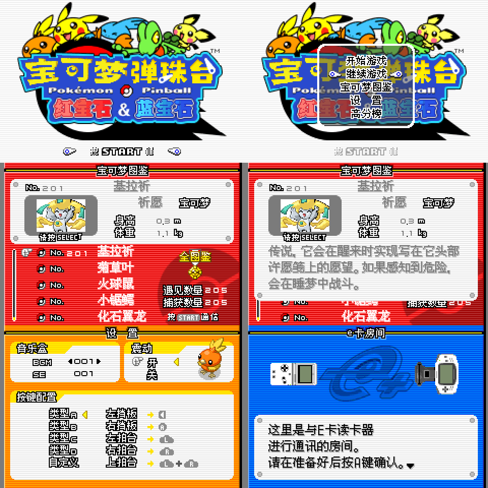

# PokemonPinballRubySapphire_CHN
* 《宝可梦弹珠台 红宝石&蓝宝石》新汉化补丁v1.2
* Chinese translation patch of Pokemon Pinball Ruby&Sapphire (jp)v1.2

# 目录
* [汉化说明](#汉化说明)
* [汉化名单](#汉化人员名单)
* [汉化更新信息](#汉化信息)
* [震动功能说明](#关于震动功能)
* [汉化版构建说明](#汉化版构建)
* [credit](#credit)
* [声明](#声明)
* [攻略](./resources/攻略.md)

# 汉化说明
本项目为GBA游戏《宝可梦弹珠台 红宝石&蓝宝石》的新汉化补丁程序。

本汉化基于日版初版游戏从头进行程序调整和文本图片汉化。需将ips补丁打在日版初版rev0弹珠台上。v1.2版代码现重整为**armips**格式，可点击`build.bat`进行编译。不同构建方法详见[汉化版构建说明](#汉化版构建)。

基于新的字库程序和字体选择，在观看宝可梦图鉴及图鉴描述时，会有着比以往旧汉化版更好的视觉效果。

（悄悄地说，字模和图鉴描述其实是从3代官译汉化项目里直接拿来用的

# 汉化人员名单
程序：卧看微尘

翻译：卧看微尘

美工：卧看微尘

测试：卧看微尘

# 汉化信息
平台：GBA
## v1.0
时间：2023年8月22日

说明：
* 初次发布。
* 七夕节贺礼，暨《宝可梦弹珠台 红宝石&蓝宝石》二十周年纪念（日版发售于2003年8月1日）。

crc32:faad00c1

md5:a9ce874f6c1d9ec981ec7bd2d6b39582

sha1:3e3a750c4074a61d565efb6460297fcd3cb2e1bd

## v1.1
时间：2023年8月26日

说明：
* 修正vba模拟器进入图鉴白屏问题
* 修复及优化调整部分图片
* 在设置界面添加版本号
* 发布说明添加游戏相关攻略内容

crc32:9a75523e

md5:d93aa0a4134eccb368b5cf4cab986185

sha1:276dae68a50ed1fc303723099b5da68bbde09222

## v1.2
时间：2023年9月4日

说明：
* 新增部分细节图片汉化
* 参考@djedditt震动代码、gbatek技术文档、ezflash代码，对震动代码进行大更新：
  * 支持ezode、ez3in1、InsideGadgets（震动卡）、Analogue Pocket主机（需使用ap版补丁）的震动支持，
  * 卡带插入ngc的GameBoyPlayer时，卡带将不震动，仅调用ngc手柄原生震动。
* 攻略部分内容修正。

### 主补丁
crc32:ab8f28e4

md5:65da764b44ff1aca923ea456547f5fb9

sha1:32490bbbd4dd350b3d0ad9d121f7a82c41454fd3

### AP版补丁
crc32:9f3c3bd1

md5:5d81834491ea2f4c8e0142829c365dd9

sha1:eecb7c5ad17747251399d9fc93597f448aa87ee0

# 关于震动功能
由于弹珠台的原生震动功能，需要在NGC的GameBoyPlayer设备上运行时，才能在设置里开启。在单独的gba游玩时，震动选项会被禁用。故本汉化加入了对EZODE烧录卡震动的支持，可以在游戏内的设置选项进行开启，以搭配EZODE烧录卡震动游玩。

## v1.2更新
新增对ez3in1、InsideGadgets（震动卡）等卡带的震动支持，新增ngc的GameBoyPlayer模式下仅调用原生手柄震动，卡带不震动，新增对Analogue Pocket主机的震动支持。（需使用ap版补丁）

## Analogue Pocket兼容性（v1.2起）
由于Analogue Pocket目前疑似硬编码仅支持DRILL DOZER（螺旋破坏者轰振钻子）游戏运行时，插入官方slot2震动卡带可以进行震动，故ap版补丁为修改文件头为DRILL DOZER的名称，以实现在AP主机上的震动。AP补丁与主补丁区别仅在于文件头不一致。

# 汉化版构建
## .ips补丁构建
1.下载并解压release内的`Pokemon PinballRS CHN v1.2.zip`，获得`Pokemon PinballRS CHN v1.2.ips`。

2.自行获取GBA弹珠台日文rev0原版`****.gba`。

3.使用ips补丁工具如Lunar IPS，或在线补丁网站，将.ips文件打入.gba文件内即可。

## ARMIPS构建（v1.2起）
1.下载 tag 为`v1.2_ARMIPS`的代码。

2.将GBA弹珠台日文rev0原版`****.gba`重命名为`baserom.gba`。

3.将`baserom_**.gba`分别置于根目录下，即

`PokemonPinballRubySapphire_CHN/baserom.gba`。

4.点击`build.bat`即可自动生成v1.2汉化的主版及AP版的rom。
* v1.2主版： `Pokemon_Pinball_chs_v1.2.gba`。
* v1.2AP版： `Pokemon_Pinball_chs_v1.2_AP.gba`。

# credit
## armips
作者：Kingcom

地址：https://github.com/Kingcom/armips

## GBA震动函数研究
### GBA原生震动接口 GBA Cart I/O Port (GPIO)
文档：GBATEK

地址：https://problemkaputt.de/gbatek.htm#gbacartioportgpio

### EZFLASH 震动接口
作者：EZflash团队

地址：https://gbatemp.net/threads/make-your-own-rumble-game-for-ez-flash-omega-definitive-edition.580909/

### 弹珠台震动相关函数研究
作者：@djedditt

震动补丁地址：https://www.romhacking.net/hacks/6256/

作者：@Phrankles

震动补丁地址：https://gbatemp.net/threads/release-pokemon-pinball-ruby-sapphire-ez-flash-omega-de-rumble-patch.600144/

# 声明
本补丁及代码仅供学习交流使用，严禁将本补丁及补丁产物用于任何商业用途或以盈利为目的的手段。

转载请注明出处，并保留发布说明。