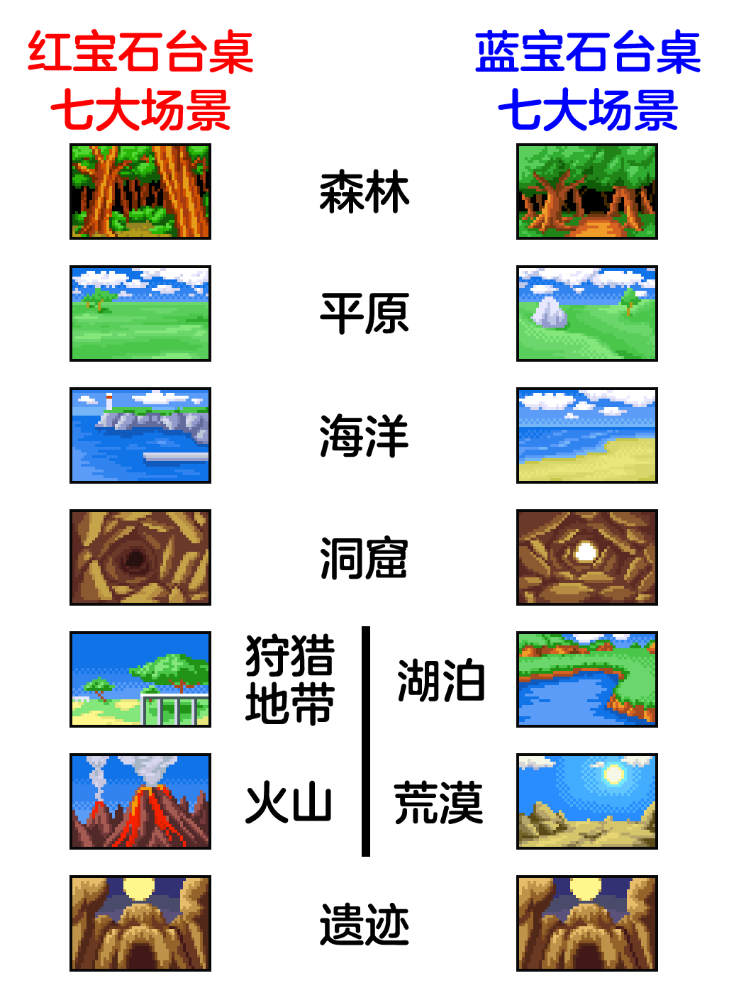

# 游戏介绍及攻略

《宝可梦弹珠台 红宝石&蓝宝石》是对应第三世代的宝可梦游戏。玩家需要通过在弹珠台内击打各种机关进入不同模式（捕获模式、进化模式、孵化、奖励关卡等）来收集各种宝可梦。

本作可捕获的宝可梦为丰缘图鉴内的宝可梦（不含代欧奇希斯），并额外有城都御三家及化石翼龙作为客串宝可梦可捕获，总计201+4=205只宝可梦可收集。

# 目录
* [一、台桌介绍](#一、台桌介绍)
* [二、旅行模式](#二、旅行模式)
* [三、捕获模式](#三、捕获模式)
* [四、孵化模式](#三、捕获模式)
* [五、进化模式](#三、捕获模式)
* [六、奖励关卡](#六、奖励关卡)
* [七、E卡房间](#六、奖励关卡)
* [八、其他](#八、其他)

# 一、台桌介绍
本作分2种台桌：红宝石台桌及蓝宝石台桌。两种台桌各有其独有机关，及限定宝可梦。限定宝可梦详见后续章节。

## 红宝石台桌独有机关：
* 1、旅行模式触发：反复触发“菊草叶->左侧直冲熊”的组合机关，集齐3个融食兽。
* 2、孵化模式触发：反复击退火球鼠直至进入洞窟内。
* 3、友好商店营业：需先敲击一次开门后，方可进入。
* 4、金币奖励坡道：反复通过火球鼠左侧地面的金币奖励坡道，可以得到金币奖励，随指示灯亮起数量变多，金币奖励也会变多。
* 5、缓冲器的切换：通过敲击缓冲器区域左侧的机关，可以切换本区域宝可梦数量种类及运行方式，偶尔会出现鲶鱼王可进入海豹球奖励关卡。。
* 6、球种升级/额外球道具：通过反复触发“菊草叶->右侧直冲熊->幕下力士->长鼻叶”的组合机关，使长鼻叶摔倒作为桥梁，可获得该道具。

## 蓝宝石台桌独有机关：
* 1、旅行模式触发：反复触发左侧篮子处的机关，集齐3个橡实果，随时间流逝橡实果会自行离开。
* 2、孵化模式触发：反复通过右侧上行坡道的孵化机器直至点亮所有指示灯。
* 3、友好商店营业：敲击正电拍拍与负电拍拍处的机关以解除门禁后，方可进入。
* 4、金币奖励坡道：反复通过友好商店左侧上行的金币奖励坡道，可以得到金币奖励，随指示灯亮起数量变多，金币奖励也会变多。将通往大嘴鸥机关及缓冲器区域。
* 5、大嘴鸥的机关：先击打大嘴鸥处乘积倍率按钮，使大嘴鸥在一定时间内面向金币奖励坡道，此时大嘴鸥会将过来的球带走，从而进入海豹球奖励关卡或直接丢回缓冲器区域。
* 6、蛇纹熊辅助：当触发蛇纹熊处机关使其头朝下时，可在老虎机滚动时立刻停止在某个奖品上。

## 共有机关：
* 1、发射弹珠：初始右下角跳跳猪进行发射。
* 2、进化模式触发：通过最左侧地面坡道，点亮3个EVO进化指示灯，可将友好商店切换为进化状态，将球进入即可触发。（v1.2版更新，“EVO”指示灯已改为“进化道”三个字）
* 3、捕获模式触发：通过最右侧地面坡道，点亮GET指示灯，可将巨牙鲨/吼吼鲸进入预备状态，将球进入即可触发。点亮1、2盏指示灯时触发捕获模式，仅在普通列表中随机选取宝可梦，点亮3盏指示灯时触发捕获模式，将在稀有列表中随机选取宝可梦。（v1.2版更新，“GET”指示灯已改为“捕获道”三个字）
* 4、球种升级奖励：位于缓冲器区域正上方，当3盏指示灯亮起时，球种将进行升级。
* 5、老虎机抽奖：当位于台桌下方的4盏H、O、L、E指示灯全部点亮时开启。随机出现若干奖品，可提前获得商店道具、或提前触发不同游戏模式。（v1.2版更新，“HOLE”指示灯已改为“老虎机洞”四个字）
* 6、皮卡丘救球：位于左右两侧底部坑位内，可以弹出落到此处的球。需要事先从最右侧坡道经过皮卡丘挡板进行充能才可使用。当皮丘辅助救球存在时，无需进行充能。
* 7、乘积倍率机关：可以将得分结算环节的累计分数进行乘积。红宝石台桌位于进入友好商店坡道前的入口，蓝宝石台桌位于大嘴鸥下方。

# 二、旅行模式

本作共有9种场景，包括5个台桌共有场景（森林、平原、海洋、洞窟、遗迹），

及2个台桌各自的独有场景，红宝石台桌（火山、狩猎地带）、蓝宝石台桌（湖泊、荒漠）。

也即每个台桌各自有7种场景可以进行旅行切换。

**初始场景确定**：每次进行新游戏，将在除遗迹场景外的6种场景中进行随机选择。

**旅行列表确定**：每当开局确定初始场景后，旅行列表将会把6种场景两两分组，共计3组进行组合，组合规则如下。

每个台桌均有一个场景顺序表

**红宝石**：森林-火山-平原-海洋-狩猎地带-洞窟-（循环至森林）

**蓝宝石**：森林-湖泊-平原-荒野-海洋-洞窟-（循环至森林）

当初始场景确定后，将按场景顺序表，以初始场景的后1、2场景，后3、4场景，后5、6场景为组进行组合，

如红宝石初始场景为狩猎地带时，分组为：

第一组：{洞窟,森林},

第二组：{火山,平原},

第三组：{海洋,狩猎地带}

当成功触发旅行模式后，将会前往本组所在的后一组场景。

同时系统会提示将球通过最左侧或最右侧坡道来决定前往后一组场景中的哪一个场景。

选择最左侧坡道时，将前往后一组中第一个场景，选择最右侧坡道，则前往后一组中第二个场景。即

———————————————

|        |左坡道  |右坡道   |

———————————————

|第一组  |洞窟    |森林     |

———————————————

|第二组  |火山    |平原     |

———————————————

|第三组  |海洋    |狩猎地带 |

———————————————

其余任意初始场景确定后的旅行列表以此类推。

**遗迹场景触发**：每当切换场景次数达到6的倍数时，将中断旅行列表，强制前往遗迹场景。

**遗迹的基拉祈**：基拉祈仅在遗迹场景的老虎机游戏中出现。

**离开遗迹场景**：在遗迹场景再次触发旅行模式，将续接中断的旅行列表继续切换场景。

若使用E卡读卡器刷入A003卡的话，初始场景将为遗迹场景，且第一个奖励关卡将为烈空坐关卡，无需上述流程。

—————————————————————————————————————————————————

—————————————————————————————————————————————————

# 三、捕获模式

不同台桌、不同场景、亮起的GET指示灯数量，将出现不同的宝可梦，总计77只宝可梦+6只超稀有宝可梦。（v1.2版更新，“GET”指示灯已改为“捕获道”三个字）

触发捕获模式后，场地中央将出现宝可梦剪影。将球弹入缓冲器区域碰撞3次，即可让剪影填满，让宝可梦出现在场地中央。

此时需要再用球击打宝可梦3次，即可捕获成功。

2种台桌各有7种场景，每种场景各有普通捕获宝可梦列表及稀有捕获宝可梦列表（指示灯3盏全部亮起时切换为稀有表）

总计2*7*2=28种捕获宝可梦列表，以下为捕获模式所有情况下的捕获宝可梦列表。

## 红宝石台桌：

**森林　　（普通）**：长鼻叶　蛇纹熊　　　甲壳茧　　　盾甲茧　　　夜巡灵　　　变隐龙　　　无　　　　　无　　　　 

**森林　　（稀有）**：木守宫　长鼻叶　　　蛇纹熊　　　甲壳茧　　　盾甲茧　　　夜巡灵　　　土居忍士　　变隐龙　　

**平原　　（普通）**：甜甜萤　落雷兽　　　土狼犬　　　小磁怪　　　霹雳电球　　傲骨燕　　　飘浮泡泡　　无　　　　

**平原　　（稀有）**：猫鼬斩　土狼犬　　　小磁怪　　　霹雳电球　　傲骨燕　　　飘浮泡泡　　无　　　　　无　　　　

**海洋　　（普通）**：吼吼鲸　长翅鸥　　　玛瑙水母　　利牙鱼　　　爱心鱼　　　触手百合　　无　　　　　无　　　　

**海洋　　（稀有）**：海星星　吼吼鲸　　　古空棘鱼　　玛瑙水母　　利牙鱼　　　爱心鱼　　　触手百合　　无　　　　

**洞窟　　（普通）**：太阳岩　大嘴娃　　　腕力　　　　臭泥　　　　甲壳龙　　　吼爆弹　　　朝北鼻　　　无　　　　

**洞窟　　（稀有）**：太阳岩　腕力　　　　凯西　　　　甲壳龙　　　吼爆弹　　　朝北鼻　　　无　　　　　无　　　　

**狩猎地带（普通）**：可达鸭　赫拉克罗斯　麒麟奇　　　凯罗斯　　　独角犀牛　　嘟嘟　　　　果然翁　　　无　　　　

**狩猎地带（稀有）**：皮卡丘　赫拉克罗斯　麒麟奇　　　凯罗斯　　　独角犀牛　　嘟嘟　　　　果然翁　　　无　　　　

**火山　　（普通）**：熔岩虫　六尾　　　　煤炭龟　　　呆火驼　　　瓦斯弹　　　盔甲鸟　　　无　　　　　无　　　　

**火山　　（稀有）**：火稚鸡　六尾　　　　煤炭龟　　　呆火驼　　　瓦斯弹　　　盔甲鸟　　　无　　　　　无　　　　

**遗迹　　（普通）**：铁哑铃　雷吉洛克　　雷吉艾斯　　无　　　　　无　　　　　无　　　　　无　　　　　无　　　　

**遗迹　　（稀有）**：铁哑铃　雷吉洛克　　雷吉艾斯　　雷吉斯奇鲁　无　　　　　无　　　　　无　　　　　无　　　　

## 蓝宝石台桌：

**森林　　（普通）**：懒人獭　毒蔷薇　　　甲壳茧　　　盾甲茧　　　夜巡灵　　　变隐龙　　　无　　　　　无　　　　

**森林　　（稀有）**：热带龙　懒人獭　　　毒蔷薇　　　甲壳茧　　　盾甲茧　　　夜巡灵　　　土居忍士　　变隐龙　　

**平原　　（普通）**：胖丁　　落雷兽　　　土狼犬　　　小磁怪　　　霹雳电球　　傲骨燕　　　飘浮泡泡　　无　　　　

**平原　　（稀有）**：电萤虫　饭匙蛇　　　胖丁　　　　土狼犬　　　小磁怪　　　霹雳电球　　傲骨燕　　　飘浮泡泡　

**海洋　　（普通）**：鲤鱼王　长翅鸥　　　玛瑙水母　　利牙鱼　　　爱心鱼　　　太古羽虫　　无　　　　　无　　　　

**海洋　　（稀有）**：珍珠贝　鲤鱼王　　　古空棘鱼　　玛瑙水母　　利牙鱼　　　爱心鱼　　　太古羽虫　　无　　　　

**洞窟　　（普通）**：月石　　幕下力士　　臭泥　　　　甲壳龙　　　吼爆弹　　　朝北鼻　　　无　　　　　无　　　　

**洞窟　　（稀有）**：月石　　幕下力士　　勾魂眼　　　凯西　　　　甲壳龙　　　吼爆弹　　　朝北鼻　　　无　　　　

**湖泊　　（普通）**：角金鱼　玛力露　　　莲帽小童　　泥泥鳅　　　龙虾小兵　　丑丑鱼　　　无　　　　　无　　　　

**湖泊　　（稀有）**：水跃鱼　玛力露　　　莲帽小童　　泥泥鳅　　　龙虾小兵　　丑丑鱼　　　无　　　　　无　　　　

**荒漠　　（普通）**：天秤偶　玛沙那　　　超音波幼虫　刺球仙人掌　小拳石　　　阿勃梭鲁　　无　　　　　无　　　　

**荒漠　　（稀有）**：青绵鸟　玛沙那　　　超音波幼虫　刺球仙人掌　小拳石　　　阿勃梭鲁　　无　　　　　无　　　　

**遗迹　　（普通）**：铁哑铃　雷吉洛克　　雷吉艾斯　　无　　　　　无　　　　　无　　　　　无　　　　　无　　　　

**遗迹　　（稀有）**：铁哑铃　雷吉洛克　　雷吉艾斯　　雷吉斯奇鲁　无　　　　　无　　　　　无　　　　　无　　　　

除上述常规宝可梦列表外，在特定情况下，捕获模式也会出现部分“超稀有”宝可梦。

**超稀有宝可梦出现基本条件**：

* 图鉴捕获数量达到100及以上，

* 及本局已捕获5只及以上宝可梦后，

* 有1%概率在捕获模式出现超稀有宝可梦。

**超稀有宝可梦种类**：拉帝欧斯、拉帝亚斯、菊草叶、火球鼠、小锯鳄、化石翼龙。

其中，拉帝欧斯为红宝石台桌限定，拉帝亚斯为蓝宝石台桌限定，

菊草叶、火球鼠、小锯鳄、化石翼龙为特别客串宝可梦（虽然图鉴内写为红宝石台桌客串，但其实达成条件后两个台桌均可出现。但如果仅论宝可梦的图片的话，4者确实在红宝石台桌内都有出场）。

**特别客串宝可梦的额外条件**：除上述基本条件外，特别客串的4只宝可梦有额外的出现条件，即必须在图鉴内已经拥有遇见图鉴或捕获图鉴。若不曾有过遇见图鉴，那么特别客串宝可梦必定不会出现，达成基本条件后仅会出现拉帝欧斯或拉帝亚斯。

若特别客串宝可梦有遇见过，达成基本条件后，捕获模式将会优先出现遇见但未捕获的超稀有宝可梦。

若存在多个遇见但未捕获的宝可梦，或均已捕获过，那么将在这些超稀有宝可梦中进行随机选择。

若使用E卡读卡器刷入A002卡的话，将会在进入台桌后的第一次捕获模式，固定出现4只特别客串宝可梦之一，且优先出现还未捕获的宝可梦。若均已捕获过，将在4个中随机选择。

若使用E卡读卡器刷入A005卡的话，将会使超稀有宝可梦出现基本条件的1%提升为2%。

# 四、孵化模式

不同台桌可以孵化出不同的宝可梦，总计31只宝可梦+1只超稀有宝可梦。

触发孵化模式后，需要将球击打在场地中游走的宝可梦2次，即可捕获成功。

以下为不同台桌的孵化宝可梦列表。

**红宝石台桌**　**蓝宝石台桌**

刺尾虫　　　刺尾虫

橡实果　　　莲叶童子

拉鲁拉丝　　拉鲁拉丝

蘑蘑菇　　　溜溜糖球

咕妞妞　　　咕妞妞

向尾喵　　　露力丽

超音蝠　　　超音蝠

可可多拉　　可可多拉

正电拍拍　　走路草

负电拍拍　　溶食兽

走路草　　　跳跳猪

跳跳猪　　　穿山鼠

穿山鼠　　　晃晃斑

晃晃斑　　　大颚蚁

大颚蚁　　　宝宝丁

怨影娃娃　　怨影娃娃

风铃铃　　　风铃铃

小果然　　　天然雀

天然雀　　　小小象

小小象　　　雪童子

雪童子　　　海豹球

海豹球　　　太阳珊瑚

太阳珊瑚　　灯笼鱼

墨海马　　　墨海马

宝贝龙　　　宝贝龙

除上述常规宝可梦外，在特定情况下，孵化模式也会出现“超稀有”宝可梦——皮丘。

**超稀有宝可梦出现基本条件**：

* 上一次捕获的宝可梦不能是皮丘，

* 及本局已捕获5只及以上宝可梦后，

* 有2%概率在捕获模式出现超稀有宝可梦。

若使用E卡读卡器刷入A005卡的话，将会使超稀有宝可梦出现基本条件的2%降低为1%。

这点与捕获模式的超稀有宝可梦概率刚好相反。

# 五、进化模式

共有92只宝可梦可通过进化模式捕获。其中部分宝可梦可直接在捕获模式内捕获。

触发进化模式后，需要将球击中在场地中的进化图标3次，才可进化成功。

根据进化方式不同，进化图标可能为：

* 等级进化：EXP经验值

* 亲密度：爱心

* 进化石：水滴、火焰、雷电、叶子、月亮、太阳。

* 通讯进化：联系绳

* 美丽度：宝可方块

不同台桌对部分带分支进化的宝可梦，存在限定进化路线。

**红宝石台桌：**

走路草->臭臭花->霸王花

**蓝宝石台桌：**

走路草->臭臭花->美丽花

刺尾虫、珍珠贝在两个台桌的进化路线没有限定，为随机选择。

土忍居士将在进化为铁面忍者的时候，同时获得脱壳忍者。

# 六、奖励关卡

本作有6种奖励关卡：夜巡灵关卡、变隐龙关卡、海豹球关卡、固拉多关卡、盖欧卡关卡、烈空坐关卡。

奖励模式内球掉落不会结束游戏，但会降低球种等级。

其中海豹球关卡为挑战小游戏，可在任何时候通过老虎机或鲶鱼王（红宝石）/大嘴鸥（蓝宝石）进入。

其余5个关卡需要达到一定条件才可按顺序出现，且不同台桌存在限定关卡。

**红宝石限定奖励关卡**：变隐龙关卡、固拉多关卡。

**蓝宝石限定奖励关卡**：夜巡灵关卡、盖欧卡关卡。

每当3个精灵球图标全亮时，便会进入台桌内的第一个奖励关卡（变隐龙/夜巡灵），

其后再次达成条件时，进入第二个奖励关卡（固拉多/盖欧卡），但此时第1次进入关卡无法捕获固拉多或盖欧卡，需要在第2次进入该关卡时才可捕获。

烈空坐关卡将在捕获固拉多或盖欧卡之后出现，同样第1次无法捕获，需要第2次进入时才可捕获。

具体流程见下：

（3个精灵球图标全亮）->第1次变隐龙/夜巡灵关卡->

（3个精灵球图标全亮）->第1次固拉多/盖欧卡关卡（固拉多/盖欧卡不可捕获）->

（3个精灵球图标全亮）->第2次变隐龙/夜巡灵关卡->

（3个精灵球图标全亮）->第2次固拉多/盖欧卡关卡（固拉多/盖欧卡可捕获）->

（3个精灵球图标全亮）->第1次烈空坐关卡（烈空坐不可捕获）->

（3个精灵球图标全亮）->第3次变隐龙/夜巡灵关卡->

（3个精灵球图标全亮）->第3次固拉多/盖欧卡关卡（固拉多/盖欧卡不可捕获）->

（3个精灵球图标全亮）->第4次变隐龙/夜巡灵关卡->

（3个精灵球图标全亮）->第4次固拉多/盖欧卡关卡（固拉多/盖欧卡可捕获）->

（3个精灵球图标全亮）->第2次烈空坐关卡（烈空坐可捕获）->……（回到初始继续循环）

若使用E卡读卡器刷入A001卡的话，可以直接进入奖励关卡选择界面，选择游玩6种关卡。该模式下无法捕获宝可梦。

若使用E卡读卡器刷入A003卡的话，初始场景将为遗迹场景，且第一个奖励关卡将为烈空坐关卡，无需上述流程。

# 七、E卡房间

本作在logo界面按住->键的同时连续多次按下L+R键，即可进入E卡通讯房间。

本作配套共发布过5种E卡，每张卡需要将长边和短边的条码均刷入后，才可进入E卡内容。（本次附带E卡raw数据）

**以下是E卡介绍**：

* A001:通讯后可以直接进入6种奖励关卡的选择界面。（注意，此处无法捕获神兽）

* A002:通讯后进入任意台桌，并进入捕获模式，可以激活4种特别客串的宝可梦之一进行捕获。每次刷入只能激活1只，如需集齐需要反复通讯。每次激活的宝可梦都会是4只宝可梦内还未激活过的宝可梦。若4只宝可梦均已激活过，则之后刷入激活的宝可梦将在4之中随机选择。

* A003：通讯后进入台桌，将固定以遗迹场景开局，且第一个奖励关卡固定为烈空坐关卡。

* A004：通讯后将开启豪华模式，进入台桌后，固定以9球数量、大师级球种等级、99金币、皮丘救球辅助开局。

* A005：通讯后进入台桌，在捕获模式内将更容易出现稀有的宝可梦。

**没有E卡或不会使用模拟器读取e卡数据的玩家，可以使用如下金手指开启e卡效果。**

* A001：奖励关卡选择

——0200B0C2:0B

——0200B0C3:01

——注：在logo界面或台桌选择界面使用，即可出现6种奖励关卡界面。初次显示会有图形错误，进入任意关卡游玩后，图形即正常。（调出关卡界面后记得关闭金手指。）

* A002：特别客串宝可梦

——0200B0C7:01

* A003：遗迹场景

——0200B0CA:01

* A004：豪华模式

——0200B0C9:01

* A005:稀有提升

——0200B0C8:01

# 八、其他

* 1、按住<-键的同时连续多次按下L+R键，为清除数据。

在图鉴界面及高分榜界面的数据为独立的数据，若需清空，需要两处均进行清除数据操作。

* 2、图鉴和高分榜界面可以按START键与其他玩家通信混合数据，来获得图鉴及共享高分榜分数。该通信不锁区，日、美、欧版弹珠台均可互通数据。

* 3、鉴于第三节捕获模式内特别客串宝可梦出现的额外条件，若想在游戏内单机捕获特别客串宝可梦，则必须事先与其他已经有过图鉴的玩家进行通信混合图鉴，才可后续单机出现。而其他玩家溯源最初能获得特别客串宝可梦的合法方式，仅有与E卡进行通信。

也即是说，合法获得特别客串宝可梦，必定无法绕开E卡。必须先有玩家参与官方活动获得过特别客串宝可梦图鉴（遇见图鉴即可），才可在活动结束后，通过通信共享给其他玩家，其他玩家才可单机遇见。这同样也是未发行过E卡的欧美版弹珠台玩家获得特别客串宝可梦的唯一合法方式。（由于美版发售时，日本活动还在进行，故存在带着美版卡来日本接收日版e卡读卡器数据的可能性。欧版则仅能通过通信共享的方式获得）

* 4、友好商店的额外球需要99金币购买，购买之后需要再次捕获烈空坐才可重新出现在友好商店内。

* 5、额外球的获得方式：友好商店购买、老虎机抽奖、捕获15个宝可梦、红宝石台桌菊草叶组合机关（偶尔出现）。

**5张e卡演示视频**：https://www.bilibili.com/video/BV1Su411N7s2